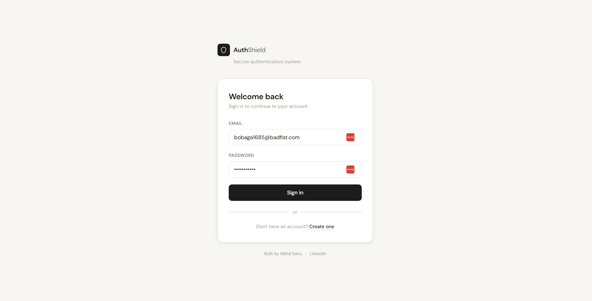
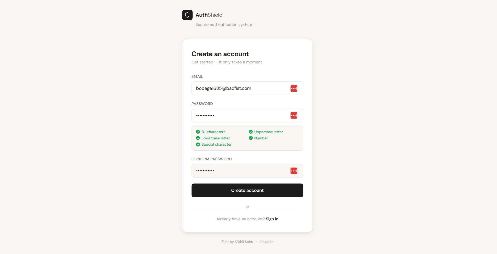
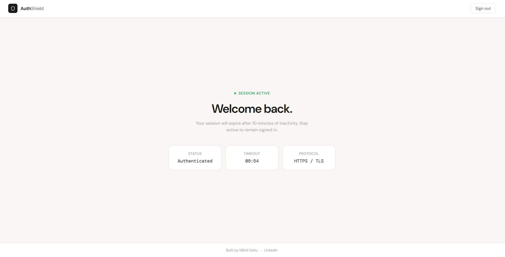

# AuthShield

A simple authentication system built with Flask and MySQL. Includes registration, login, rate limiting, and account lockout with email-based unlocking.

---

## Features

- User registration with password strength validation
- Login with client-side and server-side validation
- IP-based rate limiting (3 failed attempts → 1 min cooldown)
- Account lockout after repeated failures, with email unlock link
- Session timeout after 10 minutes of inactivity
- Passwords hashed with bcrypt

---

## Screenshots

### Login


### Register


### Dashboard


## Project Structure

```
authshield/
├── app.py
├── email_sender.py
├── database_setup.sql
├── requirements.txt
├── .gitignore
├── screenshots/
│   ├── screenshot1.png
│   └── screenshot2.png
├── config/
│   ├── database_config.py
│   └── email_config.py
├── templates/
│   ├── login.html
│   ├── register.html
│   └── dashboard.html
└── static/
    ├── styles.css
    ├── script.js
    ├── register.js
    └── dashboard.js
```

---

## Setup

### 1. Clone the repo

```bash
git clone https://github.com/heynick1337/authshield.git
cd authshield
```

### 2. Create a virtual environment and install dependencies

```bash
python -m venv venv
source venv/bin/activate      # Windows: venv\Scripts\activate
pip install -r requirements.txt
```

### 3. Set up the database

Run the SQL file in your MySQL client:

```sql
source database_setup.sql
```

### 4. Configure database credentials

Edit `config/database_config.py`:

```python
app.config['MYSQL_HOST']     = 'localhost'
app.config['MYSQL_USER']     = 'root'
app.config['MYSQL_PASSWORD'] = 'your_password'
app.config['MYSQL_DB']       = 'authshield'
```

### 5. Configure email (for unlock emails)

Edit `config/email_config.py`:

```python
EMAIL_ADDRESS = "your_email@gmail.com"
EMAIL_PASSWORD = "your_app_password"
```

You'll need a Gmail App Password — generate one at: Google Account → Security → 2-Step Verification → App Passwords.

### 6. Run the app

```bash
python app.py
```

Open `http://localhost:5000` in your browser.

---

## Notes

- The secret key in `app.py` should be changed before deploying anywhere
- Unlock tokens expire after 15 minutes
- The autofill-detection fix in the JS uses a CSS animation trick — some browsers don't fire the normal `input` event when autofilling, which was keeping the submit button disabled

---

## Built by

[Nikhil Sahu](https://github.com/heynick1337) · [LinkedIn](https://linkedin.com/in/sahunikhil01)
